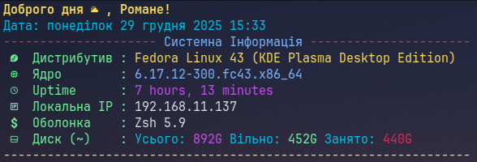

# zsh-config
`ZSH` одна з командних оболонок Unix. Поєднує риси bash і деяких раніших версій. `ZSH` створено Полом Фолстадом 1990 року, зараз підтримується спільнотою. Розробку проєкту координує Пітер Стефенсон.

Серед важливих рис `ZSH`, що роблять його зручним для користувачів, — гнучка система вибірки файлів, можливість редагування багаторядкових команд, потужні засоби автодоповнення вводу, у тому числі з підтримкою автодоповнення аргументів для різних популярних команд, виправлення помилок, розділення історії команд між паралельними сеансами, велика кількість



# Встановлення Z-Shell

- Debian/Ubuntu based
```bash
sudo apt install zsh
```
```bash
sudo nala install zsh
```
- Arch based
```bash
sudo pacman -S zsh zsh-completions
```
- Fedora Linux
```bash
sudo dnf install zsh
```
Після встановлення `ZSH` потрібно змінити оболоноку що використовується терміналом за замовчуванням, оскільки Bash використовується більшістью дистрибутивів із коробки. Для цього існують наступні команди:

```bash
chsh -s $(which zsh)
```
або
```bash
chsh -s $(which /usr/bin/zsh)
```

## Встановлення OH-MY-ZSH та плагінів.


В моїх налаштуваннях використовується фрейворк `OH-MY-ZSH` - разом із ним потрібно встановити деякі плагіни що не взодять до складу `OH-MY-ZSH`

- Встановлення `OH-MY-ZSH`

```bash
sh -c "$(curl -fsSL https://raw.githubusercontent.com/ohmyzsh/ohmyzsh/master/tools/install.sh)"
```

- Встановлення потрібних плагінів

- `Zsh Autosuggestions` - Він пропонує команди, поки ви їх вводите на основі історії та автозавершеннь.

```bash
git clone https://github.com/zsh-users/zsh-autosuggestions.git $ZSH_CUSTOM/plugins/zsh-autosuggestions
```

- `Zsh Syntax Highlighting` -  Цей пакет забезпечує синтаксисне виділення для `ZSH`. Це дозволяє виділити команди, поки вони вводяться як підказку для `ZSH`. Це допомагає переглянути команди перед тим, як запустити їх, особливо допомогає в уловлюванні помилок синтаксису.

```bash
git clone https://github.com/zsh-users/zsh-syntax-highlighting.git $ZSH_CUSTOM/plugins/zsh-syntax-highlighting
```

## Файлова структура


Після завантаження репозиторія файли із папки `conf.d`  - потрібно перемістити (скопіювати) в папку налаштувань за наступним шляхом:
`$HOME/.config/zsh/conf.d`
Файл `zshrc` - перемістити (скопіювати) в корінь домашнього каталогу на змінити назву на `.zshrc`
